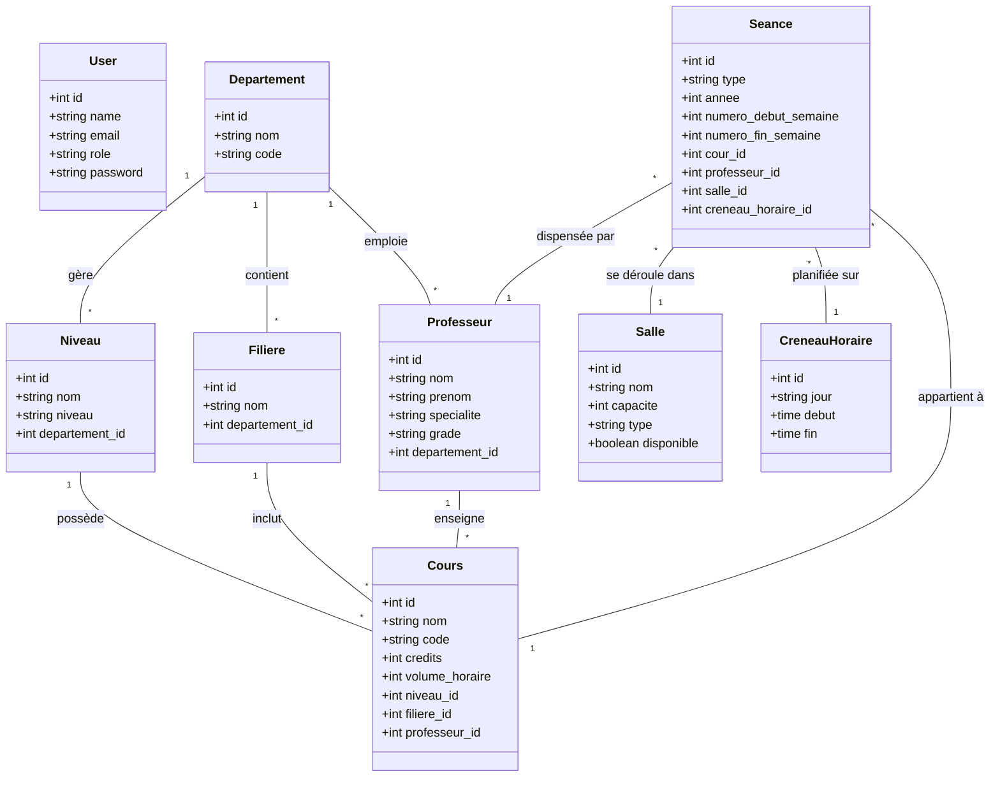

# Diagramme de Classe - Système SamaPlan

Ce diagramme illustre les relations entre les principales entités du système de gestion d'emploi du temps.

### Description des relations clés :
1.  **Cœur du système (Séance) :** La `Seance` est l'entité centrale qui lie un `Cours`, un `Professeur`, une `Salle` et un `CreneauHoraire`. C'est ici que les conflits sont vérifiés.
2.  **Structure Académique :** Le `Departement` est la racine qui regroupe les enseignants, les filières et les niveaux (classes).
3.  **Planification :** Les `CreneauHoraire` définissent les plages disponibles (ex: Lundi 08h-10h) qui peuvent être réutilisées par plusieurs séances de différentes classes/salles.
